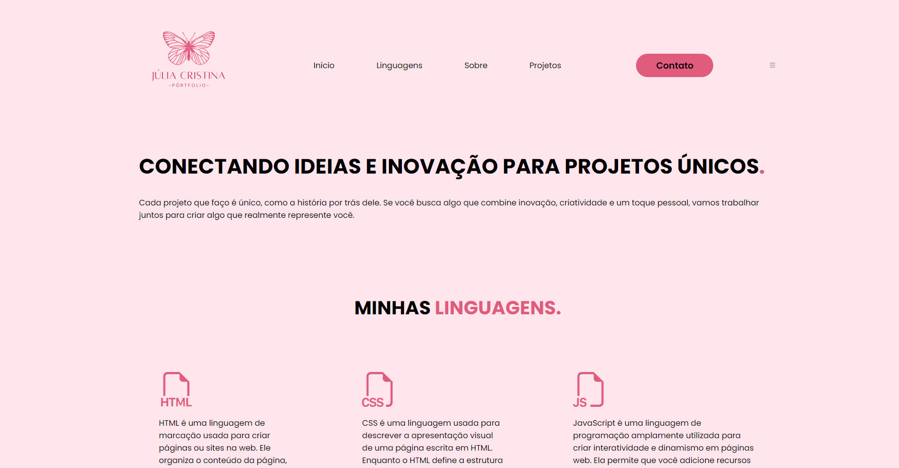

## MEU PÓRTFOLIO

### HTML (Hypertext Markup Language)

- *Tipo*: Linguagem de marcação.
- *Propósito*: HTML é utilizado para estruturar o conteúdo de páginas web. Define a organização dos elementos, como títulos, parágrafos, listas, links e imagens.
- *Características*:
  - *Tags*: Usa tags (como 
, <a>, 
) para identificar e descrever elementos na página.
  - *Estrutura*: Cria uma hierarquia de elementos, como <html>, <head>, e <body>.
  - *Estático*: Estabelece a estrutura do conteúdo, mas não controla o comportamento ou a aparência além de marcar o conteúdo.

### CSS (Cascading Style Sheets)

- *Tipo*: Linguagem de estilo.
- *Propósito*: CSS é utilizado para definir a apresentação e o layout dos elementos HTML. Controla aspectos visuais, como cores, fontes, espaçamentos, alinhamento e design geral da página.
- *Características*:
  - *Seletores e Regras*: Utiliza seletores (como p, .classe, #id) para aplicar regras de estilo a elementos HTML.
  - *Propriedades de Estilo*: Define propriedades como color, font-size, margin, padding, e background-color para alterar a aparência dos elementos.
  - *Design Responsivo*: Permite a criação de layouts que se adaptam a diferentes tamanhos de tela usando media queries.
  - *Cascata e Herança*: Estilos podem ser sobrepostos e herdados, permitindo uma aplicação flexível e hierárquica de estilos.

### JavaScript

- *Tipo*: Linguagem de programação.
- *Propósito*: JavaScript é utilizado para criar interatividade e dinamismo em páginas web. Permite a manipulação do conteúdo e o comportamento da página em resposta a ações do usuário.
- *Características*:
  - *Manipulação do DOM*: Permite acessar e modificar o conteúdo e a estrutura da página web através do DOM (Document Object Model).
  - *Eventos*: Pode responder a eventos como cliques, envio de formulários e carregamento da página.
  - *Lógica e Condições*: Suporta lógica condicional, loops e funções, permitindo criar comportamentos complexos e interativos.
  - *Comunicação com o Servidor*: Permite enviar e receber dados do servidor de forma assíncrona, melhorando a experiência do usuário.

### Integração de Design

Juntas, essas linguagens permitem criar uma experiência de usuário completa e atraente:

- *HTML* define a estrutura básica, como onde os elementos estão localizados na página.
- *CSS* dá vida ao design, aplicando estilos que tornam a página visualmente atraente e funcional, além de garantir que o design seja responsivo e acessível.
- *JavaScript* adiciona interatividade, permitindo que os usuários interajam com os elementos da página, como clicar em botões, preencher formulários e receber feedback em tempo real.

Essas três tecnologias formam a base do desenvolvimento web moderno, permitindo a criação de páginas web ricas e dinâmicas que são tanto funcionais quanto estéticas.